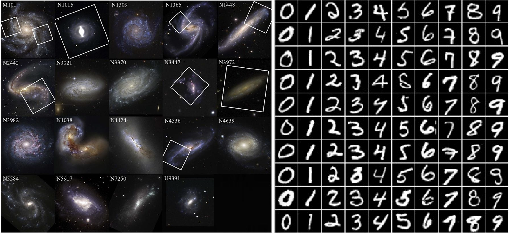

# ABOUT THE PROJECT
* Currently there are no official benchmarking datasets in astronomy (astro-MNIST) that can be used by the community to compare different ML models and techniques in order to understand the improvements and benefits of novel approaches.
* It is becoming increasingly hard to compare results to previous ML studies by other groups and authors. Not everyone uploads their dataset/code/detailed instructions to reproduce the published results. 
* Goal of the project - gather resources in one spot - links to available simulators (for dataset generation) and simualted / observed datasets; links to hosted datasets we prepared for various astronomical research fields (galaxy images, variable stars, superova spectra etc.). Produce example jupyter files for using datasets to facilitate easier use and learning.

# ASTRO + ML BEST PRACTICES
* We believe in fair, transparant, open and reproducible science. 
* Here we summarize what we believe are best practices for acheaving these goals. Modern research (esspetially if it includes novel computing or machine learning techniques) has to comply with a set of requirement in order for other researchers to be able to understand, compare and reproduce the results. Without transparency in both data aquiral / preprocessing, coding and hyper parameter fine tuning, but also without model benhmarking on standardized but simple datasets (before applying models to specialized datasets unque for that research topic), we cannot produce trustworthy and reliable scientific results. 

## DATA
.......fill in......

## CODE
.......fill in......

# SIMULATIONS 

## DeepBench
.......fill in......

## SkyPy
This package contains methods for modelling the Universe, galaxies and the Milky Way. Also included are methods for generating observed data.
- Galaxy morphology, luminosity and redshift distributions
- Halo and subhalo mass distributions
- Gravitational Wave binary merger rates
- Power Spectra using CAMB and Halofit
- Pipelines to generate populations of astronomical objects

Access the repo [here](https://github.com/skypyproject/skypy).

# SIMULATED DATASETS
.......fill in......

# REAL DATASETS
.......fill in......

# WANT TO CONTRIBUTE?
* We need combined knolwedge from the entire astro comunity and researchers from different fields! Are you working in ML? Do you have a sutable dataset that can be used for benchmaring? Do you have experience in coding, open-source software? Please reach out if you want to help!

