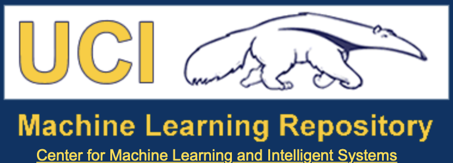

# ABOUT THE PROJECT
* Currently there are no official benchmarking datasets in astronomy (astro-MNIST) that can be used by the community to compare different ML models and techniques in order to understand the improvements and benefits of novel approaches.
* It is becoming increasingly hard to compare results to previous ML studies by other groups and authors. Not everyone uploads their dataset/code/detailed instructions to reproduce the published results. 
* Goal of the project - gather resources in one spot - links to available simulators (for dataset generation) and simulated / observed datasets; links to hosted datasets we prepared for various astronomical research fields (galaxy images, variable stars, supernova spectra etc.). Produce example Jupyter files for using datasets to facilitate easier use and learning and include a set of guidelines for astro-ML "best practices".

# ASTRO + ML BEST PRACTICES
* We believe in fair, transparent, open and reproducible science. 
* Below, we summarize what we believe are best practices for achieving these goals. Modern research (especially if it includes novel computing or machine learning techniques) has to comply with a set of requirements in order for other researchers to be able to understand, compare and reproduce the results. 
* Without transparency in both data acquisition/ preprocessing, coding and hyperparameter fine tuning, but also without model benchmarking on standardized but simple datasets (before applying models to specialized datasets unique to that research topic), we cannot produce trustworthy and reliable scientific results. 

## DATA
* **Data Acquisition**

- State all steps used to extract data from a database (if not as detailed instructions in the paper or the appendix of the paper, then point to the online resources you have that accompany the paper you published, i.e. GitHub repo or similar). 
- It would be useful to other researchers looking into your work if you also included SQL code or any other code you used to query the data.

* **Data Preprocessing**

- State all the steps taken chronologically to transform raw data to processed/tidy data (see [this](https://vita.had.co.nz/papers/tidy-data.pdf) paper). For example, you could write "created new columns for the mean and median of cols 1 and 2", "removed NaNs".
- It may also be useful if you provide images of or tables of the head of the data at each step of the preprocessing.

* **Data Description**

- State at what time and from where (which telescope/database) the data was collected.
- Include a “codebook” describing each variable and its units. 
- Perform exploratory analysis! Include visualizations from this analysis. This can be included in the repo page as additional content for readers.

* **Datasets in the Context of ML**

- The data sets for the supervised ML should be always clearly separated: validation set, training set and test set. Make sure you clearly state which subset is used when, since especially validation and test set names are often used interchangeably. 
- Explain in what ways the sets were chosen. Were images shuffled before separation? If so, is the random seed fixed and which seed was used? Were techniques such as k-fold cross validation involved?

## CODE

- Provide source code or pseudocode used to create plots/interact with data publicly or host a notebook/interface from which people can interact with the raw/tidy data. 
- Consider having a GitHub (or similar) repo where you can host all additional material and code and provide links to the datasets used (provided you are hosting them somewhere). Also include all the relevant links in the published paper.
- Mention the programming language, OS type and version, and version of software packages used.

* **Neural networks**

- If possible visualize your neural network.
- Briefly explain model architecture and give details about all hyperparameters used when training was performed. State which loss function was used, as well as the name of the optimizer and its parameters. 
- Justify your chosen metric in the choice of best parameters.
- Provide plots with training metric (training and validation loss/accuracy), and also report multiple performance metrics (precision, recall, F1 score etc.). If relevant, provide confusion matrices.
- Provide details about the best model chosen for testing phase. What is the reason for choosing the particular model? Is the goal of the model to maximize accuracy, precision or some other metric? Why?

# SIMULATIONS 

## DeepBench

Simulation library for very simple simulations to benchmark machine learning algorithms. 
- Simple geometrical shapes that can resemble different astronomical objects

Access the repo [here](https://github.com/deepskies/DeepBench).

## SkyPy

This package contains methods for modelling the Universe, galaxies and the Milky Way. Also included are methods for generating observed data.
- Galaxy morphology, luminosity and redshift distributions
- Halo and subhalo mass distributions
- Gravitational Wave binary merger rates
- Power Spectra using CAMB and Halofit
- Pipelines to generate populations of astronomical objects

Access the repo [here](https://github.com/skypyproject/skypy).

## Galaxy2Galaxy

This is a [library](https://github.com/ml4astro/galaxy2galaxy) of models, datasets, and utilities to build generative models for astronomical images. Next to useful models using Variational Auto-Encoders, Self-Attention GANs, PixelCNNs and Normalizing Flows, it also has packages that can be used to generate usefull datasets:

- Framework for building image datasets using GalSim, a framework for simulating astronomical objects like stars or galaxies (read more about GalSim [here](https://github.com/GalSim-developers/GalSim)).

- Tools for building an image dataset from HSC Public data release.

# SIMULATED DATASETS

## Bolognia Lens Factory

The BLF collects simulated gravitational lenses of different kinds and from different projects and makes them available to the community for any possible usage. Data sets can be in different formats (tables, maps, images) and some projects consist of simulated observations of gravitational lensing systems, mimicking the observing capabilities of existing or future facilities. Available datasets target lenses on a broad range of scales - lensing by galaxies, galaxy clusters and the large scale structure of the universe. You can access these datasets [here](http://metcalf1.difa.unibo.it/blf-portal/index.html).

## Illustris Simulations

“The [IllustrisTNG project](https://www.tng-project.org) is an ongoing series of large, cosmological magnetohydrodynamical simulations of galaxy formation. TNG aims to illuminate the physical processes that drive galaxy formation: to understand when and how galaxies evolve into the structures that are observed in the night sky, and to make predictions for current and future observational programs. The simulations use a state of the art numerical code which includes a comprehensive physical model and runs on some of the largest supercomputers in the world”. 

- A useful labeled dataset, extracted from Illustris-1 simulation, containing around 15000 merging galaxies (on redshift z=2) by Aleksandra Cirpijanovic can be found [here](https://drive.google.com/drive/folders/1p01Q3uDseGVsoiOzvhbJqynWLCP28D8X?usp=sharing). Dataset is made to mimic Hubble Spacetelescope observations (HST like PSF added on to the simulated images) and contains two types of images - wih and without observational noise.

## MAGIC Gamma Telescope Dataset

[This dataset](https://archive.ics.uci.edu/ml/datasets/magic+gamma+telescope), available on the UCI Machine Learning Repository, consists of 19020 Monte Carlo-generated instances of simulated registration of high energy gamma particles in a ground-based atmospheric Cherenkov telescope using the imaging technique.

## SKA Science Data Challenge #1 Dataset

The data consists of 9 simulated SKA continuum images in FITS format in total intensity of the same field at 3 frequencies and 3 telescope integrations. It can be found [here](https://astronomers.skatelescope.org/ska-science-data-challenge-1/).

## Observing Dark Worlds

Training data for Kaggle’s (now closed) challenge “Observing Dark Worlds” can be found [here](https://www.kaggle.com/c/DarkWorlds/data). The challenge involved predicting the center of each dark matter halo in 120 simulated test skies, with the training set being 300 files of simulated skies containing 300-740 galaxies each.

## Nyx Cosmological Simulation Data

A sample dataset based on the Lawrence Berkeley National Laboratory’s compressible cosmological hydrodynamics simulation code Nyx is available [here](https://ieee-dataport.org/open-access/nyx-cosmological-simulation-data).

## Microlensing Data Challenge 

These [data](https://github.com/microlensing-data-challenge/data-challenge-1) are associated with the Microlensing Data challenge (about which more information can be found [here]( https://microlensing-source.org/data-challenge/)) and consist of light curves simulated as those expected from the WFIRST survey.

## Quijote Simulations
“The [Quijote simulations](https://github.com/franciscovillaescusa/Quijote-simulations) are a set of 43100 full N-body simulations. They are designed for two main tasks: (1) Quantify the information content on cosmological observables; (2) Provide enough statistics to train machine learning algorithms. But they can be used for a large variety of problems.”

# REAL DATASETS

## AstroML

AstroML constains various datasets. Below we are presenting review.
AstroML has available routines for downloading and working on the astronomical data sets. For more details, see the documentation [therein](https://www.astroml.org/modules/classes.html#module-astroML.datasets).

### Sloan Digital Sky Survey (SDSS) Data

The survey obtained photometry for hundreds of millions of stars, quasars, and galaxies, and spectra for several million of these objects. In addition, the second phase of the survey performed repeated imaging over a small portion of the sky, called Stripe 82, enabling the study of the time-variation of many objects.

SDSS photometric data are observed through five filters, u, g, r, i, and z. A visualization of the range of these filters is shown below:

- [SDSS filters](https://www.astroml.org/examples/datasets/plot_sdss_filters.html)  

- [SDSS Spectra](https://www.astroml.org/examples/datasets/plot_sdss_spectrum.html) 

- [SDSS photometry](https://www.astroml.org/examples/datasets/plot_sdss_galaxy_colors.html)

- Other datasets:

There are several other available datasets to choose from: [SDSS corected Spectra](https://www.astroml.org/examples/datasets/plot_corrected_spectra.html), [SDSS Spectroscopic Sample](https://www.astroml.org/examples/datasets/plot_sdss_specgals.html), [SDSS DR7 Quasar Catalog](https://www.astroml.org/examples/datasets/plot_dr7_quasar.html); data from other surveys such as [Nasa Sloan Atlas](https://www.astroml.org/examples/datasets/plot_nasa_atlas.html) and [Stripe 82 Standards + 2MASS](https://www.astroml.org/examples/datasets/plot_sdss_S82standards.html),
time Domain Data like [RRLyrae](https://www.astroml.org/book_figures/chapter10/fig_rrlyrae_reconstruct.html) or [LIGO data](https://www.astroml.org/examples/datasets/plot_LIGO_spectrum.html) and [WMAP temperature map](https://www.astroml.org/examples/datasets/plot_wmap_power_spectra.html).

For more please see [here](https://www.astroml.org/user_guide/datasets.html).

### Example notebooks

AstroML also contains many example notebooks that can help the user extract and use the available datasets:

- One of many examples available in the astroML package is a notebook for using a Convolutional Neural Network for classifying SDSS galaxy images. It can be accessed [here](https://www.astroml.org/book_figures/chapter9/fig_morph_nn.html). Note that there are many more examples available.

- Example (by Stephen Portillo) for using a dataset from astroML (RR Lyrae) with a decision tree algorithm can be found [here](https://github.com/AleksCipri/AstroBenchmarking/blob/master/examples/astro-ML_RRLyrae.ipynb).

## KiDS Data Release 3 Quasar Catalog

The [catalog](http://kids.strw.leidenuniv.nl/DR3/quasarcatalog.php
), prepared by Nakoneczny et al., includes around 190000 quasar candidates. These candidates were identified using a random forest classifier from among a cleaned KiDS inference dataset.

## Datasets for GalSim

A dataset of real galaxies extracted from the HST COSMOS survey and compiled by Rachel Mandelbaum et al. for use with GalSim to produce realistic simulations can be found in the associated [Zenodo repo](https://zenodo.org/communities/galsim/?page=1&size=20).

## HTRU2 Dataset

The [HTRU2 dataset](https://archive.ics.uci.edu/ml/datasets/HTRU2#:~:text=HTRU2%20is%20a%20data%20set,emission%20detectable%20here%20on%20Earth.), available on the UCI Machine Learning Repository, describes a sample of pulsar candidates collected during the High Time Resolution Survey (South). The dataset contains 17898 instances (1639 being pulsars) and 9 attributes (mean of the integrated profile, mean of the DM-SNR curve, etc.).

## Solar Flare Dataset

The Solar Flare dataset, also available on the UCI Machine Learning Repository, consists of 1389 instances, each of which capture features for one active region on the Sun. 3 classes of flares (C, M, and X), and their number within a 24-hour period can be predicted using the provided attributes.

## PLAsTiCC Challenge Dataset

This data was originally used for the PLAsTiCC challenge on Kaggle in order to identify promising methods to classify variable and transient light curves. It has now been unblinded and is available on a [Zenodo repo](https://zenodo.org/record/2539456#.X1HYgcgzbIU).

## NOAO Survey Program Archives

The [NOAO survey archives](https://www.noao.edu/survey-archives/) provide access to data from multiple surveys focusing broadly on the deep “blank” sky, nearby galaxies/clusters of galaxies and stellar populations in local group galaxies.

## Open Exoplanet Catalog

A database of all discovered extrasolar planets. The codebook and steps to access the data are available on the associated [GitHub repo](https://github.com/OpenExoplanetCatalogue/open_exoplanet_catalogue).

## Penn State University Astrostatistics Data

[This webpage](https://astrostatistics.psu.edu/datasets/index.html) hosts several prepackaged astronomical datasets (including univariate, multivariate, images, model selection, spectra, etc.) for statistical analysis. Two example datasets on the site are the [Shapley galaxy redshift catalog](https://astrostatistics.psu.edu/datasets/Shapley_galaxy.html) and [SDSS quasar catalog](https://astrostatistics.psu.edu/datasets/SDSS_quasar.html).

## Galaxy Zoo Data
Galaxy Zoo was a citizen science project with the purpose of classifying the morphologies of ~1 million galaxies imaged by the SDSS. The classification data, along with measurements of bulge size, presence of bars, and the structure of spiral arms, are now available [here](https://www.kaggle.com/c/galaxy-zoo-the-galaxy-challenge/data) on Kaggle.

## Optical Gravitational Lensing Experiment (OGLE) data

OGLE is an observing project that started in 1992. It has the longest ground based observational data set of the Southern sky, specifically the Magellanic Clouds. OGLE gives png format pictures of the periodic variable stars. If a pulsating star has more than one pulsational period then folded light curves are given for all the present periods. This means that there is also additional data for each star: period of pulsation(s), Fourier parameters (from light curve decomposition). The light curves on the png pictures are in the I filter. There were some differences in the catalogs from one release to the other. Here, we have the OGLE Collection of Variable Stars and OGLE-III. 

### OGLE Collection of Variable Stars (OCVS)
- 639 309 stars in total
- Types of variables: classical Cepheids (CEP), anomalous Cepheids (ACEP), Type II Cepheids (T2CEP), RR Lyrae variables (RRLYR), eclipsing stars (ECL)
- Find the data [here](http://ogledb.astrouw.edu.pl/~ogle/OCVS/index.php)

### OGLE-III Data
- 399 651 stars
- Types of variables: classical Cepheids (CEP), anomalous Cepheids (ACEP), Type II Cepheids (T2CEP), RR Lyrae variables (RRLYR), eclipsing stars (ECL), Long Period Variables (LPV), Double Period Variables (DPV), R CrB stars (RCB), delta Scuti stars (DSCT)
- Find the data [here](http://ogledb.astrouw.edu.pl/~ogle/CVS/)

## Minor Planet Center (MPC) Data
The [MPC site](https://minorplanetcenter.net/data) hosts a large volume of data regarding the orbits of thousands of small bodies in the Solar System. You can access data about the orbits of all the asteroids or comets in the MPC database, along with much more!

## Photo-z catalogs

Photometric redshift catalogs presented in [Beck et al. 2017](https://arxiv.org/abs/1701.08748) that can be used to probe color coverage and photometric errors can be accessed at [this](https://github.com/COINtoolbox/photoz_catalogues) GitHub repo; one of the products of the third edition of the COIN Residence Program.

# LEARNING AND USEFUL READS
- [Reproducible Machine Learning](https://towardsdatascience.com/reproducible-machine-learning-cf1841606805), an article published on the Medium blog Towards Data Science (and a reference for this project!), is a really good starting point for developing a set of best practices to achieve reproducibility in astro+ML.
- The [Towards Data Science](https://towardsdatascience.com/) publication itself includes superb, in-depth tutorials on anything and everything in data science.
- [Machine Learning Mastery](https://machinelearningmastery.com/start-here/) is another great blog which guides the reader through the code, theory and applications of ML.

# WANT TO CONTRIBUTE?
* We need combined knowledge from the entire astro comunity and researchers from different fields! Are you working in ML? Do you have a suitable dataset that can be used for benchmarking? Do you have experience in coding, open-source software? Please reach out if you want to help!
